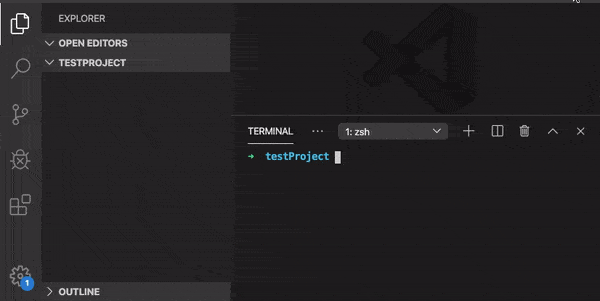

<p align="center">
  <b>protpl</b>
  <br />
  <span>帮助你快速创建各种项目工程！</span>
  <br>
  <a href="https://www.npmjs.org/package/protpl"></a> <a href="https://travis-ci.org/echosoar/protpl"></a>
  <br>
  
  <br>
  
</p>

## 使用
```shell
$ npm i protpl -g
```

```shell
$ p init
```

## 目前支持的模板类型


| name | desc |
| --- | --- |
| TypeScript Module | 基于 TypeScript 的NPM模块工程 |
| TypeScript Modules Manage By Lerna | 基于 Lerna、TypeScript 的多个NPM模块工程 |
| TypeScript React App By Snowpack | 基于 Snowpack、TypeScript 的React应用工程 |
| Javascript Module Build By Rollup | 基于 Rollup 的JS/Node模块工程 |
| React Component Module | 基于 TypeScript 的React模块工程 |

## 选项
### Init
#### --npm=<npm>
可以指定npm镜像，如cnpm等
#### --name=<模板类型>
用于指定使用哪个模板进行初始化，默认为显示选择列表